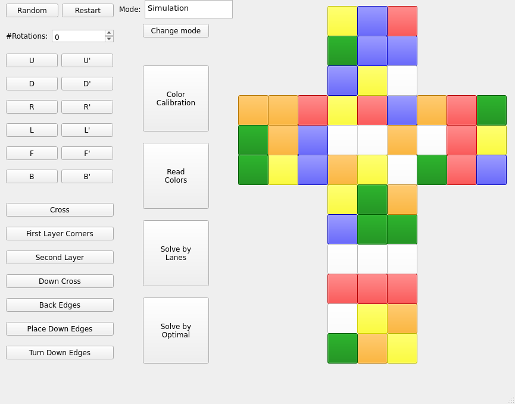
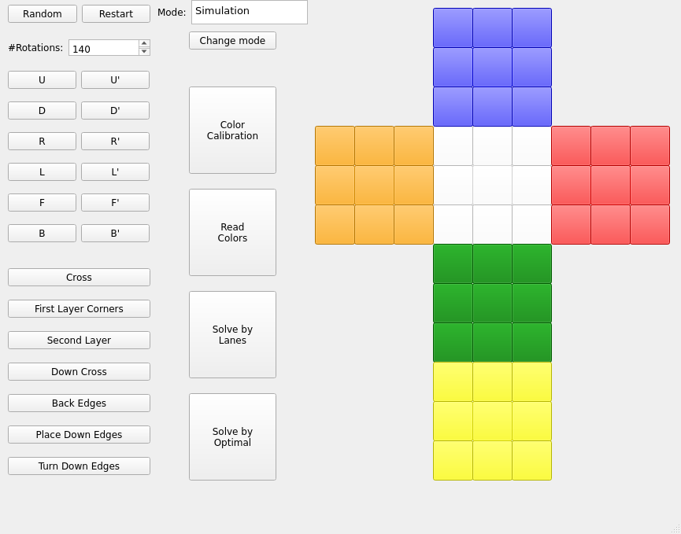
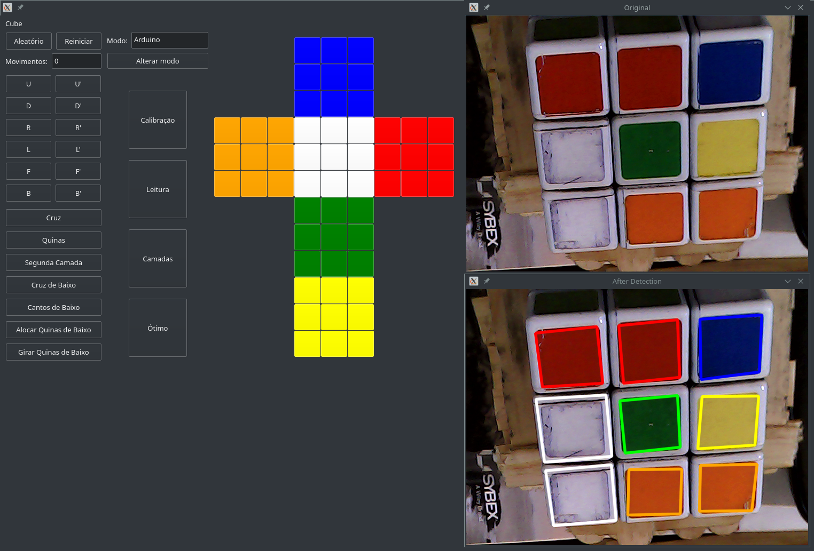

# Cube

Final project of my undergraduation program.

Robot that uses a webcam to take pictures of the sides of the rubik's cube and
creates a virtual model of it.
It is possible to create any model by changing the colors of the cube in the program.

The cube can be solved by two methods, the layer methods, with a lot of rotations
and another method that is near to the optimal.

## Getting Started

These instructions will get you a copy of the project up and running on your local machine for development and testing purposes.

### Prerequisites

```
qt5
qmake
make
opencv2
```

### Installing

Download the repo and

```
$ mkdir build
$ cd Rubiks-Cube-Solver/
$ chmod +x format.sh
$ chmod +x run.sh
$ make
$ cd ../build/
$ qmake ../cube/cube.pro
$ make
```
### Using

```
$ cd build
$ ./cube
```

## Videos
<a href="http://www.youtube.com/watch?feature=player_embedded&v=56DlDcRQmCs
" target="_blank"></a>

<a href="http://www.youtube.com/watch?feature=player_embedded&v=gJWaPxXLR8s
" target="_blank"></a>

## Images






## Acknowledgments

* Using brownan cube solver: https://github.com/brownan/Rubiks-Cube-Solver
* Using Alyssaq squares.cpp: https://github.com/alyssaq/opencv
